# Costly Expenses App

Link to the deployed project: https://costly-413690edf851.herokuapp.com/

# Purpose of this project

The Costly app is here to let a user better organize, display, edit and delete their expenses. By simply clicking on 'Add Expense' and filling out the simple form the user can add their costs to a list. They can also edit these expenses or delete them. Additionally the user gets informed about their total cost of all the expenses.

# Table of contents

# User demographic

The user demographic for an expense tracking app typically includes people from many age groups, families managing household finances, and small business owners tracking business expenses. These users look for ways to gain better control over their finances, track spending habits, and achieve their financial goals.

# User experience
As a user, I want to be able to:
- Securely log in to my account using authentication credentials.
- Access and view my own expenses.
- Add new expenses.
- Edit or update details of my existing expenses.
- Ensure that my financial data remains private and secure.

# Agile methodology

Throughout this project, an Agile approach was taken in order to develop the app. Each of the three Epics were broken down into smaller User Stories, which were then refined into more manageable Tasks. Each of the User Stories has different acceptance criteria. The User Stories can be found in the kanban board linked [here](<https://github.com/users/Tekali7/projects/3/views/1>). This made the overall project much more manageable to build.

## Epics and user stories
Epics which I came up with for the app before the start of the project, which were then rewritten to fit the app in a more tailored way.

### User Authentication and Authorization
To ensure the security and privacy of user data within the expense tracking app, implementing robust user authentication and authorization mechanisms is essential.
This epic focuses on providing users with secure access to their accounts while restricting access to unauthorized users. By implementing user authentication, users can securely log in to their accounts using unique credentials, such as usernames and passwords. Additionally, user authorization ensures that authenticated users have appropriate permissions to access specific features and data within the app. This epic should show the need for a secure way in and out of the app.
- [User Story #10 Authorization](<https://github.com/Tekali7/Costly/issues/10>)

### Expense Management and Validation
 Effective management and validation of expenses are crucial aspects of the app which ensure the accuracy and reliability of financial data. This epic focuses on providing users with comprehensive tools for managing their expenses, including adding, editing, and deleting expenses. Additionally, the app also needs validation mechanisms to verify the expense data entered by users. By enabling users to track expenses accurately and reliably, this epic aims to empower users to make informed financial decisions and achieve their financial goals effectively.
- [User Story #1 Track Expenses](<https://github.com/Tekali7/Costly/issues/1>)
- [User Story #2 Edit expenses](<https://github.com/Tekali7/Costly/issues/2>)
- [User Story #4 Validate expenses](<https://github.com/Tekali7/Costly/issues/4>)
- [User Story #5 Total amount of costs](<https://github.com/Tekali7/Costly/issues/5>)
- [User Story #8 Saving expenses for each user](<https://github.com/Tekali7/Costly/issues/8>)
- [User Story #3 Delete expenses](<https://github.com/Tekali7/Costly/issues/3>)
- [User Story #6 Expense currency](<https://github.com/Tekali7/Costly/issues/6>)

### User Interface, Experience and Feedback
This epic emphasizes optimizing the UI of the app. It involves the users need for a clean and easy to navigate page. Additionally, the epic focuses on implementing feedback features such as messages when the user adds, edits or deletes an expense. The user should also get a deletion modal upon clicking the delete button, which asks the user to confirm the deletion of an expense. By prioritizing UI enhancements and feedback, this epic aims to raise user satisfaction, and overall app usability.
- [User Story #7 Friendly UI](<https://github.com/Tekali7/Costly/issues/7>)
- [User Story #9 User feedback](<https://github.com/Tekali7/Costly/issues/9>)

# Features
The app consists of one main page with many features for the user.

## Add expenses
Adds a new expense to the list of expenses including the amount and currency.
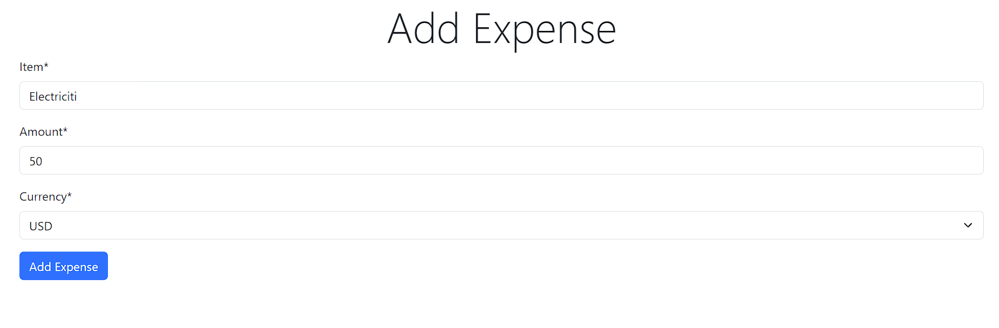

## Edit expenses
Edit an existing expense either the expense name, amount or currency.
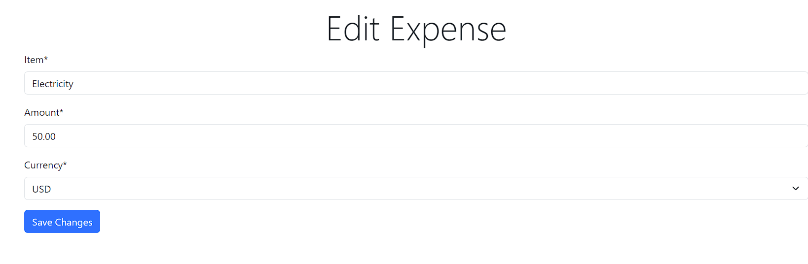

## Delete expenses
Delete an expense, the user is asked to confirm on a modal before deletion.
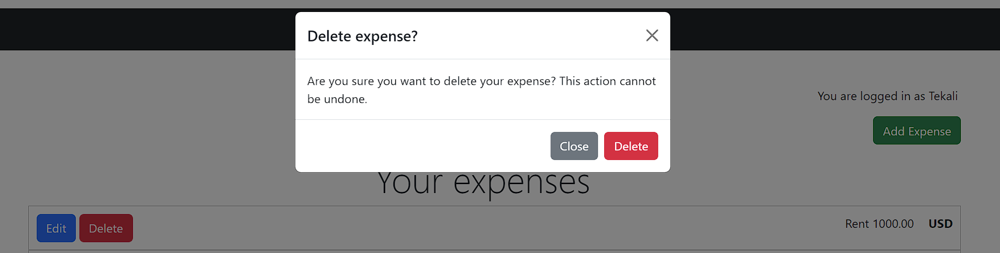

## Total cost overview
The total amount of all the expenses is displayed on the bottom of the list for transparency.
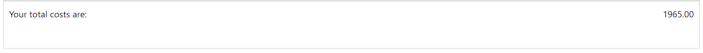

## User-Friendly Interface
The UI is user-friendly, simple and therefore easy to navigate.
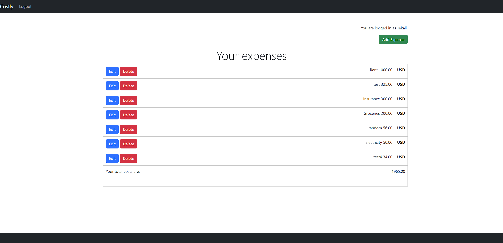

## Secure authentication
Robust authentication measures were taken place to safely store each users private data.
Every user needs to authenticate themselves before accessing the features and data.
The authentication features include Sign In, Sign up and Sign out.
### Sign In
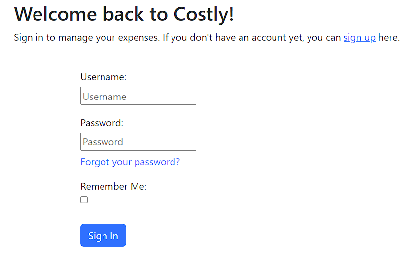
### Sign Up
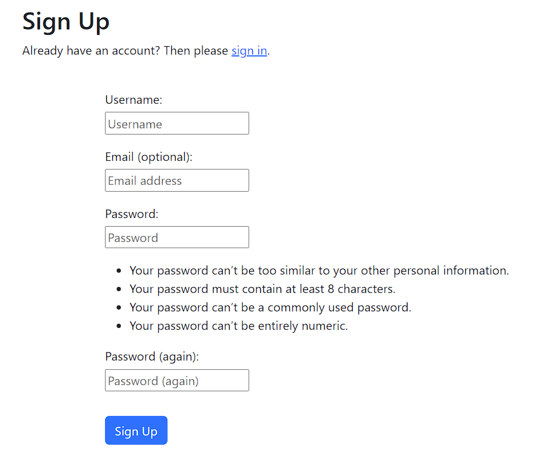
### Sign Out
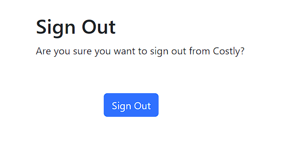

# Future features

Future features might include.

- Total cost that calculates all currencies together with consideration of their current exchange rates.

- Analytics that analyze a users spending habits over time to let them know where they could improve.

- Reminders for open payments or upcoming bills.

# Design
## Color
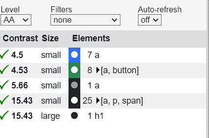
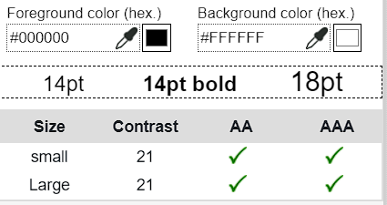

The app adopts a dark color scheme to provide contrast and ensure visibility against the background. This choice helps users quickly locate features and enhances overall usability.

## Typography
The app name stands out with a simple serif font in the navbar, and the 'page/form titles' stand out with 'Franklin Gothic Medium'.
Other than that the default font has been left.

# Wireframes
## Entity relationship diagram
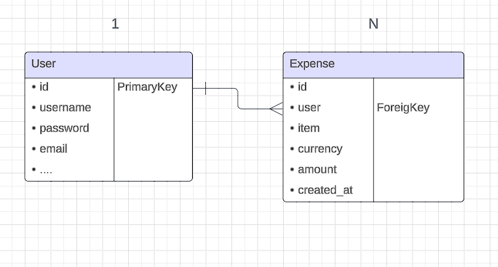

## User interface
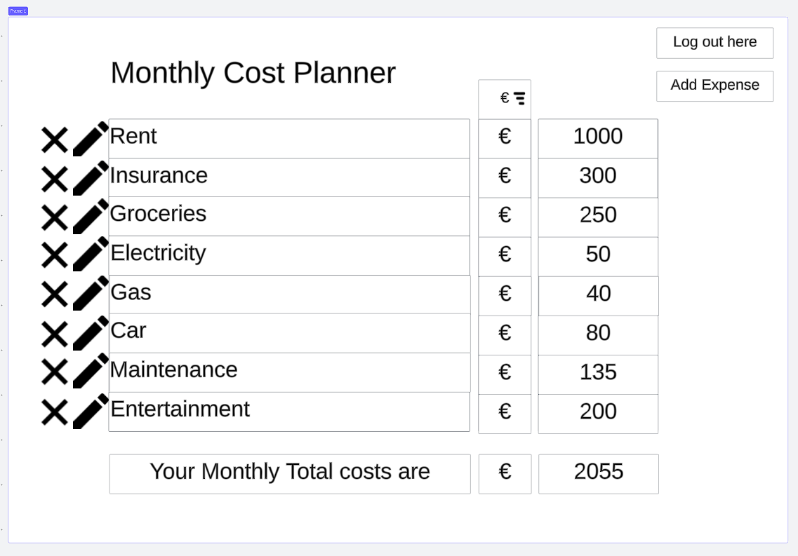

# Technology

## Languages

- HTML 5
- CSS 3
- JavaScript
- Django
- Python

## Django Packages

- Gunicorn: As the server for Heroku

- Dj_database_url: To parse the database URL from the environment variables in Heroku

- Psycopg2: As an adaptor for Python and DB

- Allauth: For authentication, registration and account management

- Crispy Forms: To style the forms

## Frameworks - Libraries - Programs Used

- Bootstrap: Was used to style the app

- Jquery: All the scripts were written using jquery library

- Git: Git was used for version control by utilizing the Gitpod terminal to commit to Git and push to GitHub

- GitHub: GitHub is used to store the project's code after being pushed from Git

- Heroku: Heroku was used to deploy the live project

- PostgreSQL: With ElephantSQL through Heroku

- Gitpod: Gitpod was used to create and edit the app

- Lucidchart: Lucidchart was used to create the database diagram

- PEP8: PEP8 was used to validate all the Python code

- W3C - HTML: W3C- HTML was used to validate all the HTML code

- W3C - CSS: W3C - CSS was used to validate the CSS code

- Google Chrome Dev Tools: To check App responsiveness and debugging

# Testing
The tests can be found [here](<https://github.com/Tekali7/Costly/blob/main/TESTS.md>)

