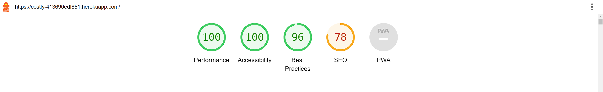

# Costly tests

Return to the README.md file [here](<https://github.com/Tekali7/Costly/blob/main/README.md>).

# Table of contents
* [Validation](<https://github.com/Tekali7/Costly/blob/main/TESTS.md#validation>)
  * [HTML Validation](<https://github.com/Tekali7/Costly/blob/main/TESTS.md#html-validation>)
  * [CSS Validation](<https://github.com/Tekali7/Costly/blob/main/TESTS.md#css-validation>)
  * [JavaScript Validation](<https://github.com/Tekali7/Costly/blob/main/TESTS.md#javascript-validation>)
  * [Python Validation](<https://github.com/Tekali7/Costly/blob/main/TESTS.md#python-validation>)
* [Manual Testing](<https://github.com/Tekali7/Costly/blob/main/TESTS.md#manual-testing>)
  * [Test Navigation when logged in](<https://github.com/Tekali7/Costly/blob/main/TESTS.md#test-navigation-when-logged-in>)
  * [Test Navigation when not logged in](<https://github.com/Tekali7/Costly/blob/main/TESTS.md#test-navigation-when-not-logged-in>)
  * [Test Login status](<https://github.com/Tekali7/Costly/blob/main/TESTS.md#test-login-status>)
  * [Test Add Expense](<https://github.com/Tekali7/Costly/blob/main/TESTS.md#test-add-expense>)
  * [Test Edit Expense](<https://github.com/Tekali7/Costly/blob/main/TESTS.md#test-edit-expense>)
  * [Test Delete Expense](<https://github.com/Tekali7/Costly/blob/main/TESTS.md#test-delete-expense>)
  * [Test Admin Panel](<https://github.com/Tekali7/Costly/blob/main/TESTS.md#test-admin-panel>)
* [Lighthouse Testing](<https://github.com/Tekali7/Costly/blob/main/TESTS.md#lighthouse-testing>)

# Validation

## HTML Validation
To check the HTML Files the [W3C Validator](https://validator.w3.org/) was used. Errors due to Django appeared like errors because of curly braces.
Unexplainable errors appeared even when validating by URI or by direct input with the page source. But they disappeared when the "/" in the page source was deleted.
I don't know where this slash appeared from but it doesn't break the app. At the time of this the tutor support was inactive and the issue wasn't anywhere to be found online.

| **File**  | **Result** |
|---|---|
| base.html | &#10004; |
| login.html | &#10004; |
| logout.html | &#10004; |
| signup.html | &#10004; |
|-|-|
| index.html | &#10004; |
| add_expense.html | &#10004; |
| edit_expense.html | &#10004; |

## CSS Validation
To check the CSS file the [Jigsaw W3C Validator](https://jigsaw.w3.org/css-validator/) was used.

| **File** | **Result** |
|---|---|
| style.css | &#10004; |

No CSS validation issues came up.

## JavaScript Validation
To check the JavaScript [JShint](https://jshint.com/) was used.

| **File** | **Result** |
|---|---|
| expense.js | &#10004; |

8 ES6 warnings came up and one undefined variable because of Bootstrap, which can be ignored because I have Bootstrap implemented.

## Python Validation
To check the Python code [CI Python Linter](https://pep8ci.herokuapp.com/) was used. Lines over 80 characters have been broken up.

| **Project/App** | **File** | **Result** |
|---|---|---|
| costly | settings.py | &#10004; |
| costly | urls.py | &#10004; |
| costly | views.py | &#10004; |
|-|-|-|
| expense | admin.py | &#10004; |
| expense | forms.py | &#10004; |
| expense | models.py | &#10004; |
| expense | urls.py | &#10004; |
| expense | views.py | &#10004; |

# Manual Testing

## Test Navigation when logged in

| **Test** | **Expected Outcome** | **Result** |
|---|---|---|
| Navigate to the main page/Log in or click on Logo | The main page of the Cost app is displayed with a list of expenses. | &#10004; |
| Click on the logout button | The user is logged out and redirected to the login page. | &#10004; |
| Verify appropriate buttons appears | Logout Button appears when logged in | &#10004; |

## Test Navigation when not logged in

| **Test** | **Expected Outcome** | **Result** |
|---|---|---|
| Attempt to access expense pages without logging in | Redirected to the login page. | &#10004; |
| Verify the absence of navigation links | No navigation links except Register and Login are visible since the user is not logged in. | &#10004; |
| Click on the login button | Redirected to the login page.	 | &#10004; |
| Click on the register button | Redirected to the signup page. | &#10004; |
| Finish signing up | New account is created and user is led to the expense list. | &#10004; |

## Test Login status
| **Test** | **Expected Outcome** | **Result** |
|---|---|---|
| Not logged in message | If the user isn't logged in, will show a small text informing about the authentication/unlogged status. | &#10004; |
| Logged in message | If the user is logged in, will show a small text informing about the authentication/logged-in status. | &#10004; |

## Test Add Expense
| **Test** | **Expected Outcome** | **Result** |
|---|---|---|
| Click Add Expense Button | The "Add Expense" form is displayed with fields to enter expense details. | &#10004; |
| Fill out the expense form with valid data | The expense is successfully added to the database. | &#10004; |
| Verify the addition of the expense | The newly added expense is visible in the list of expenses. | &#10004; |
| Fill out the expense form with invalid data | An error message is displayed, indicating the invalid input. | &#10004; |
| Submit the form without filling out any fields | An error message is displayed, indicating that all fields are required. | &#10004; |
| Add Expense Feedback | After the user adds an expense, they get confirmation with a message at the top of the page. | &#10004; |

## Test Edit Expense
| **Test** | **Expected Outcome** | **Result** |
|---|---|---|
| Click Edit Button | The "Edit Expense" form is displayed populated with the expense details. | &#10004; |
| Modify the expense details | The changes are successfully saved to the database. | &#10004; |
| Verify the updated expense | The edited expense reflects the changes made. | &#10004; |
| Submit the form without making any changes | The expense remains unchanged. | &#10004; |
| Edit Expense Feedback | After the user edits an expense, they get confirmation with a message at the top of the page. | &#10004; |

## Test Delete Expense(JavaScript)
| **Test** | **Expected Outcome** | **Result** |
|---|---|---|
| Click Delete Button | The delete confirmation modal is displayed. | &#10004; |
| Confirm deletion of an expense | The expense is successfully deleted from the database. | &#10004; |
| Verify the removal of the expense | The deleted expense is no longer visible in the list of expenses. | &#10004; |
| Cancel deletion of an expense | The expense remains unchanged in the database. | &#10004; |
| Delete Expense Feedback | After the user deletes an expense, they get confirmation with a message at the top of the page. | &#10004; |

## Test Admin Panel
The admin panel didn't  get a lot of attention during this project because it makes only little sense to apply role-based login or there to be a lot more restricted content for the superuser, because it is only a single user app.
| **Test** | **Expected Outcome** | **Result** |
|---|---|---|
| Log in as an admin/superuser | Successfully access/display the Django admin panel. | &#10004; |
| Add a new expense | Create a new expense entry in the database. | &#10004; |
| Edit an expense | Modify the details of an expense and save the changes. | &#10004; |
| Delete an expense | Remove an expense from the database. | &#10004; |

# Lighthouse Testing
Result of the Lighthouse Test of the Main Page:

